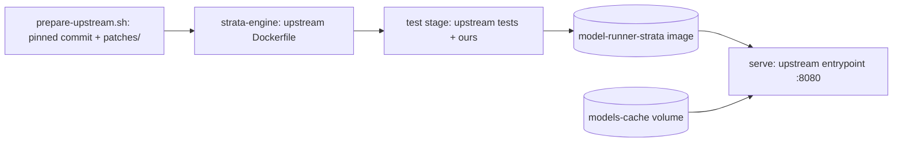

# model-runner-strata

Runs [Strata](https://github.com/Niko1221/Strata) on Linux in Docker. Strata serves
**Qwen3.8-Flash-Next Coder (IQ1_M)** split across GPUs, system RAM and SSD, with OpenAI- and
Anthropic-compatible APIs on internal port `8080`.

This repo is a thin layer over upstream's own Dockerfile and entrypoint: it pins an upstream commit, applies two
small local build patches, narrows the build to one GPU generation and adds a test gate plus operator scripts.



## Requirements

- NVIDIA GPU(s), driver 580+, and the NVIDIA Container Toolkit
- 32 GB RAM for the Coder at 128K context (64 GB recommended; 262144 context needs 64 GB)
- ~70 GB free disk

Tested on 2x RTX 3090 with 64 GB RAM at 128K context, both cards in a layer split with every expert in VRAM.

## Run

```bash
cp .env.example .env                                   # optional; defaults match the file
docker network create ai-inference 2>/dev/null || true
docker run --rm -v "$PWD:/w" -w /w --entrypoint sh alpine/git scripts/prepare-upstream.sh
docker compose --profile serve build strata            # 20-40 min, no GPU needed; fails if any test fails
docker compose --profile serve up -d --no-build strata # first start downloads ~63 GB and prepares the model
```

The server is only reachable on the `ai-inference` network at `http://model-runner-strata:8080`.
Set `STRATA_API_KEY` before exposing it to anything you don't trust.

Without an API key, upstream (since v0.1.38) answers only requests whose `Host` header is localhost, an IP address or
a name in `STRATA_ALLOWED_HOSTS`; any other name gets `403`. The default allows `model-runner-strata`, the name other
containers on the network use. Add every other name clients use (comma-separated), or set an API key.

The first start (or one with `STRATA_REINSTALL=1`) runs upstream's setup and saves the model config on the data
volume; later starts go straight to the server. `--no-build` keeps compose from rebuilding on the serving host.

## Layout

| File | Role |
| --- | --- |
| `scripts/prepare-upstream.sh` | Checks out the pinned upstream commit (`STRATA_REF`) into `upstream/` and applies `patches/`; stops if a patch no longer applies |
| `patches/0001-docker-portable-cpu-build-arg.patch` | `STRATA_PORTABLE` build arg: AVX2 CPU baseline instead of `-march=native`, so an image built on an AVX-512 machine runs elsewhere |
| `patches/0002-docker-cpu-arch-build-arg.patch` | `STRATA_CPU_ARCH` build arg: optional GCC `-march` name for the serving host's CPU family |
| `docker-compose.yml` | `strata-engine` builds upstream's Dockerfile; `strata` adds the test gate and runs upstream's entrypoint |
| `Dockerfile` | Test gate: no AVX-512 in the portable image encoder, upstream's server tests, this repo's tests |
| `scripts/install-model.sh` | Setup-only run of upstream's installer for `strata-install`: downloads and prepares a model without serving it |
| `scripts/smoke_test.py` | Scored end-to-end check of a running server |
| `scripts/benchmark.py` | Repeatable prompt/decode speed benchmark and a comparison between two runs |

The container needs unlimited locked memory and `IPC_LOCK`, because Strata pins RAM for the GPU.

## Two-GPU tuning

Since upstream v0.1.30, a layer split borrows expert-cache slots for its prompt buffers and streams the displaced
experts from RAM on every prompt. Upstream's automatic split point can also give the second card more experts than
it holds. Both cost the most on cards behind a slow host link (e.g. an eGPU). Two settings restore a split that
keeps every expert in VRAM:

| Setting | Effect |
| --- | --- |
| `STRATA_SPLIT_OWN=1` | Each card keeps its own prompt buffers (upstream default `0`) |
| `STRATA_LAYER_SPLIT=24` | First layer on the second card (upstream default: auto); saved into the model config on start |

The right split point depends on the cards and the model. Measured on 2x RTX 3090 over Thunderbolt (prompt reading,
1.4K / 15K-token prompt):

| Model | Split | Prompt reading (tok/s) |
| --- | --- | --- |
| `coder` IQ1_M, v0.1.34 | 20 | 1,332–1,369 / 2,245 |
| `qwen` Q2_0, v0.1.38 | auto (21) | 746 / 1,142 |
| `qwen` Q2_0, v0.1.38 | 24 | 1,366 / 2,467 |

After a change, check the engine log's expert-cache line and run the benchmark.

## Switching models

Install the next model in the background while the server keeps serving, then switch with a restart:

```bash
STRATA_INSTALL_FAMILY=qwen STRATA_INSTALL_MODEL=IQ3_XXS \
  docker compose --profile install run --rm strata-install   # downloads and prepares; starts no engine
# then set STRATA_FAMILY / STRATA_MODEL in .env (and revisit STRATA_LAYER_SPLIT) and:
docker compose --profile serve up -d --no-build strata
```

The installer uses the server's image, data volume and settings (context, vision, GPUs, KV, API key) and writes the
model's config next to the others in `config/`, so switching back is the same `.env` change. Sizes, downloads and
RAM needs per model: upstream's `docs/MODELS.md`.

Pick the size by how much of its experts fit in VRAM, not only by RAM: experts that don't fit are streamed to the GPUs
for every 2,048-token prompt chunk, so on a slow host link prompt reading follows the share left in RAM. On 2x RTX
3090 over Thunderbolt (1.5 GB/s), IQ3_XXS kept 77 % of its experts in VRAM and read prompts at 192–271 tok/s.

## Test

```bash
docker compose --profile serve build strata            # unit tests run inside the build
docker exec -i model-runner-strata /opt/strata/.venv/bin/python - < scripts/smoke_test.py
docker exec -i model-runner-strata /opt/strata/.venv/bin/python - run < scripts/benchmark.py > after.json
python3 scripts/benchmark.py compare before.json after.json   # exit 1 when any speed drops more than 5 %
```

The smoke test prints `score: 3/3` when `/health` answers, a coding prompt returns code containing `def add`,
and server-side decoding reaches `STRATA_MIN_TOKENS_PER_SECOND` (default 20).

## Images (vision)

`STRATA_VISION` picks the image encoder: `yes` (GPU, keeps ~1.4 GB of VRAM free), `cpu` (10-30 s per picture) or
`no` (text only). `STRATA_BUILD_VISION=0` leaves the encoder out of the build; then set `STRATA_VISION=no`.

## Updating Strata

1. Set `STRATA_REF` in `scripts/prepare-upstream.sh` and `STRATA_VERSION` in `.env`.
2. Re-run `prepare-upstream.sh`. If a patch no longer applies, check whether upstream now covers it.
3. Rebuild, then start once with `STRATA_REINSTALL=1` (model files are reused) and set it back to `0`.
4. Run the smoke test and compare the benchmark against the previous version before keeping it.
